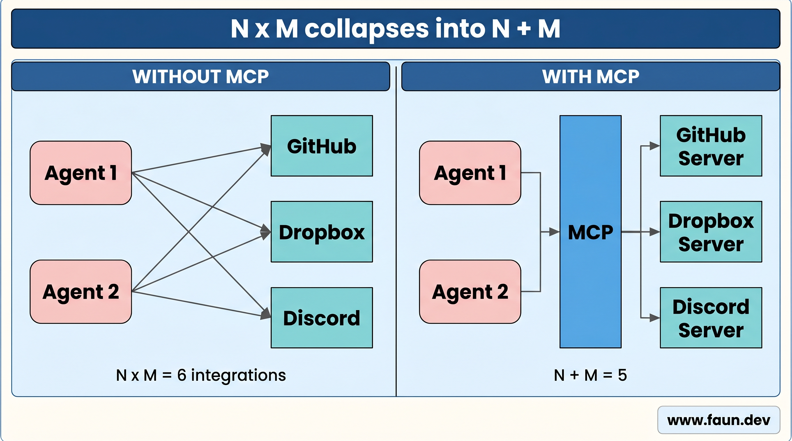

# Introduction to MCP: One Protocol Instead of a Hundred Integrations


## The USB-C of AI Integrations


## Why MCP Matters




## Setting Up an MCP Environment for Learning


```bash
curl -s https://gofastmcp.com/llms-full.txt -o $HOME/docs/llm.txt
```


### GitHub Copilot


```json
{
        "servers": {
            "deepwiki": {
                    "url": "https://mcp.deepwiki.com/mcp",
                    "type": "http"
            },
            "fastmcp": {
                "command": "npx",
                "args": [
                    "-y",
                    "@modelcontextprotocol/server-filesystem",
                    "<path-to-docs-folder>",
                ],
                "type": "stdio"
            },
            "langchain": {
                "url": "https://docs.langchain.com/mcp",
                "type": "http"
            }
        }
}
```


```text
#fastmcp Explain how to create a tool in FastMCP and how to call it from a client.

#deepwiki What is the difference between a tool and a resource in MCP?

#langchain How LangChain can help me build an MCP server?

#fastmcp #langchain How to integrate FastMCP into a LangChain agent?
```


### Claude Desktop


```json
{
  "mcpServers": {
    "deepwiki": {
      "command": "npx",
      "args": [
        "-y",
        "mcp-remote",
        "https://mcp.deepwiki.com/mcp"
      ]
    },
    "fastmcp": {
      "command": "npx",
      "args": [
        "-y",
        "@modelcontextprotocol/server-filesystem",
        "/home/eon/docs/"
      ]
    },
    "langchain": {
      "command": "npx",
      "args": [
        "-y",
        "mcp-remote",
        "https://docs.langchain.com/mcp"
      ]
    },
  }
}
```


### Claude Code


```bash
# You need to create a new workspace or open an existing one before running these commands. For example:
# mkdir $home/workspace/my-project
# cd $home/workspace/my-project

claude mcp add deepwiki --transport http https://mcp.deepwiki.com/mcp
claude mcp add langchain --transport http https://docs.langchain.com/mcp
claude mcp add fastmcp npx -- -y @modelcontextprotocol/server-filesystem <path-to-docs-folder>
```


### Other Assistants
