# Primitives, Capabilities, and Utilities: The Full MCP Feature Set and When to Use Each


## Tools (Server Side)

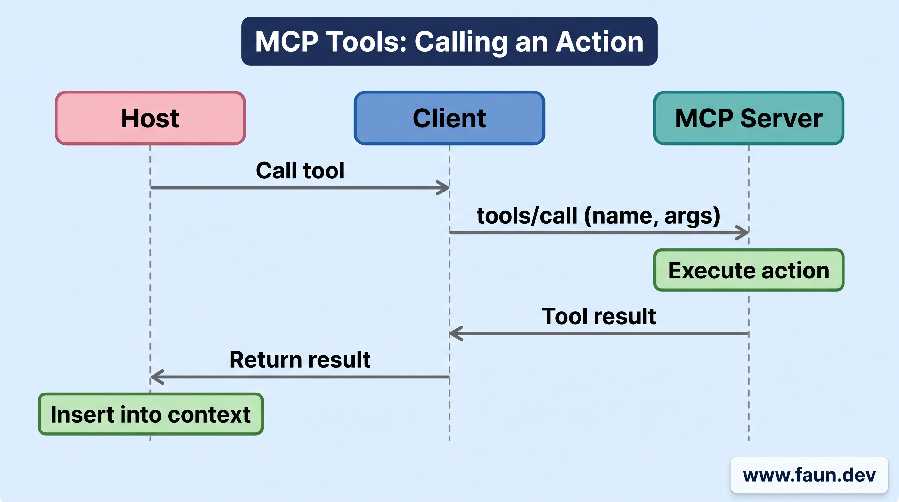


## Resources (Server Side)

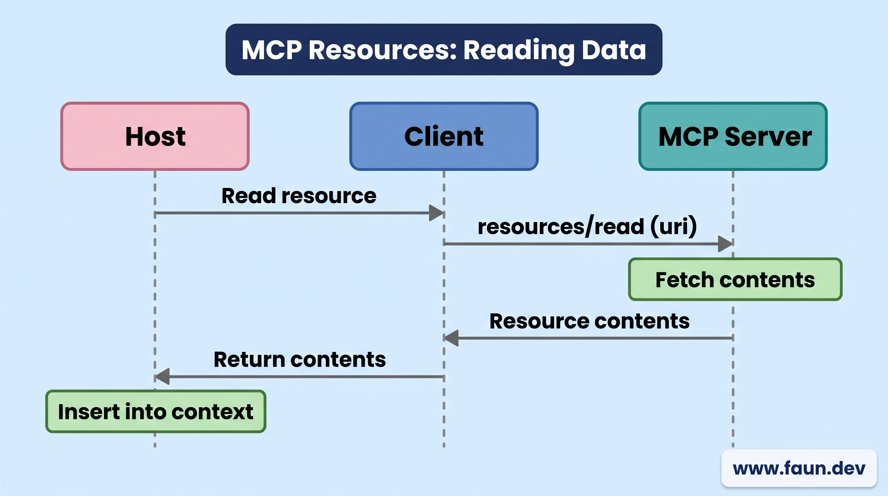


## Prompts (Server Side)


```yaml
System instruction: "You are a senior software engineer performing a strict code review. Focus on correctness, readability, performance, and security. Provide concrete suggestions. Be precise and structured."

User template: "Please review the following code and provide feedback grouped into:

1. Critical issues
2. Improvements
3. Style suggestions

Code:
{code}"
```


```yaml
System instruction: "You are an assistant that summarizes meeting notes clearly and concisely. Extract decisions, action items, and open questions. Avoid speculation."

User template: "Summarize the following meeting notes. Structure the result as:

- Key Decisions
- Action Items (with owners if mentioned)
- Open Questions

Meeting notes:
{notes}"
```

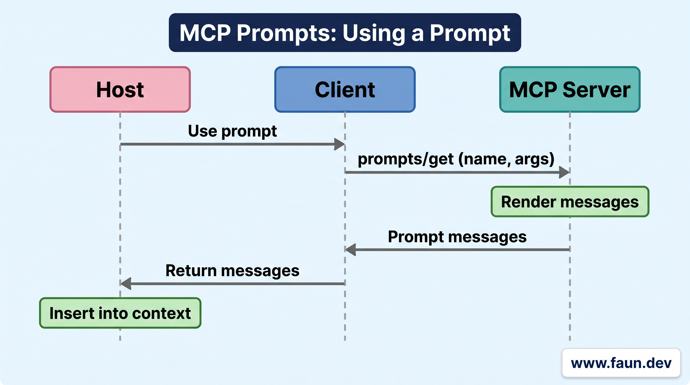


## Logging (Server Side)

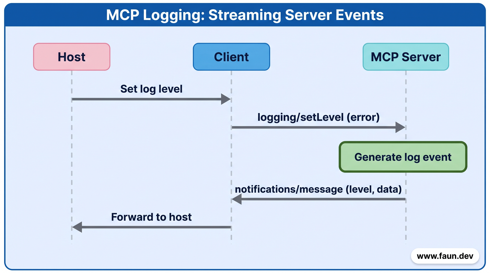


## Pagination (Server Side)


```json
{
  "jsonrpc": "2.0",
  "id": "20",
  "result": {
    "resources": [
      {"id": "file1", "name": "README.md", "uri": "mcp://repo/files/README.md"},
      {"id": "file2", "name": "auth.js", "uri": "mcp://repo/files/auth.js"}
      // ... 198 more files
    ],
    "nextCursor": "deTW456abc7M9="
  }
}
```


```json
{
  "jsonrpc": "2.0",
  "id": "21",
  "method": "resources/list",
  "params": {
    // This is the opaque cursor from the previous response
    "cursor": "deTW456abc7M9="
  }
}
```

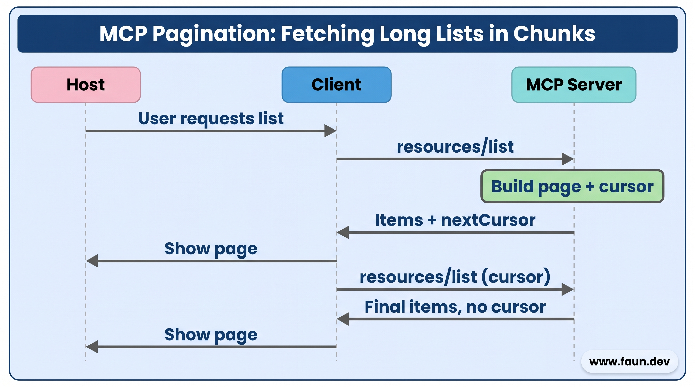


## Completions (Server Side)

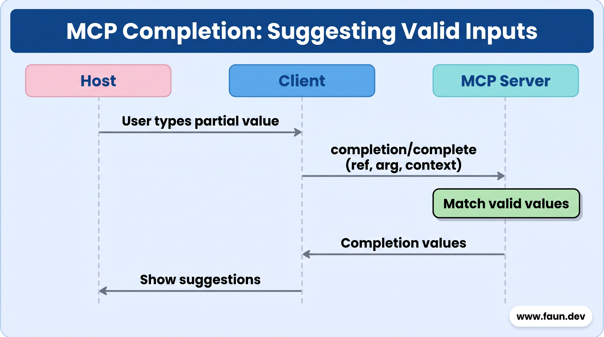


## Sampling (Client Side)


```text
Classify this support message into one of: bug, billing, feature_request, question.
Return only the label.

Message:
"I was charged twice this month and the refund button does nothing."
```

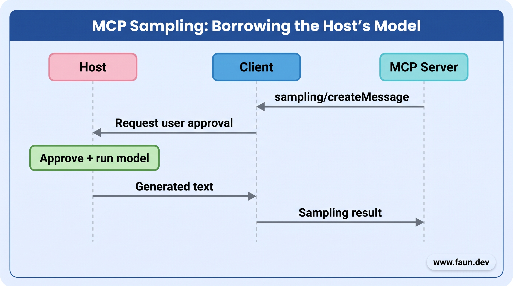


## Elicitation (Client Side)

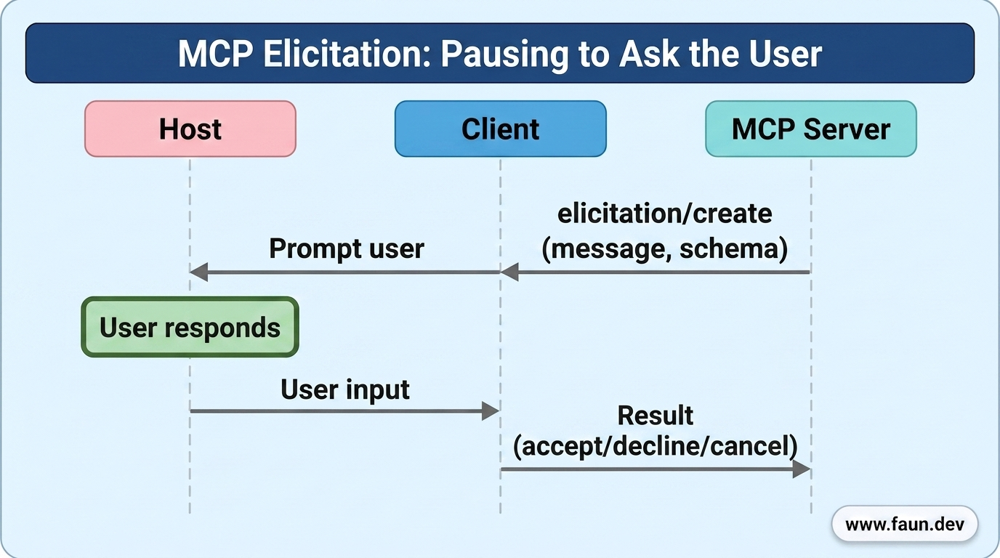


## Roots (Client Side)

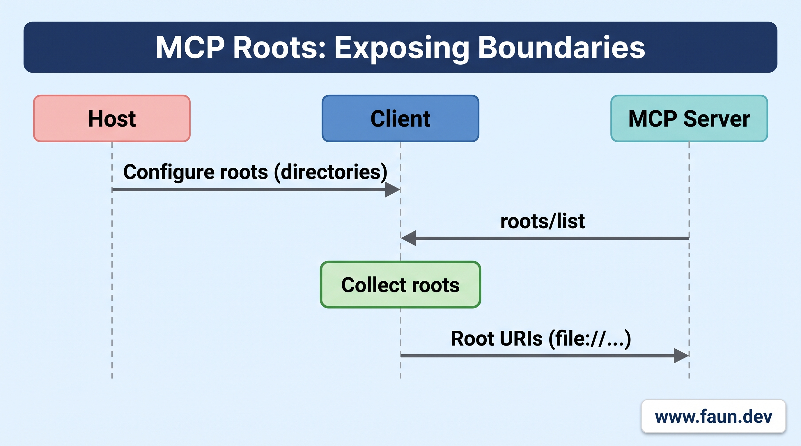


## Cancellation (Client & Server Side)


```json
{
  "jsonrpc": "2.0",
  "method": "notifications/cancelled",
  "params": {
    "requestId": "1",
    "reason": "User clicked the stop button"
  }
}
```

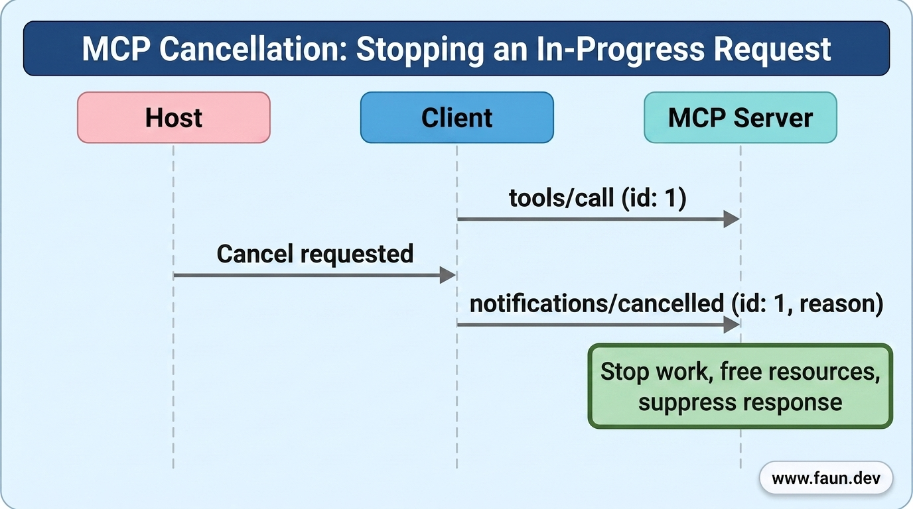


## Ping (Client & Server Side)


```json
{
  "jsonrpc": "2.0",
  "id": "ping_xyz123",
  "method": "ping"
}
```


```json
{
  "jsonrpc": "2.0",
  "id": "ping_xyz123",
  "result": {}
}
```

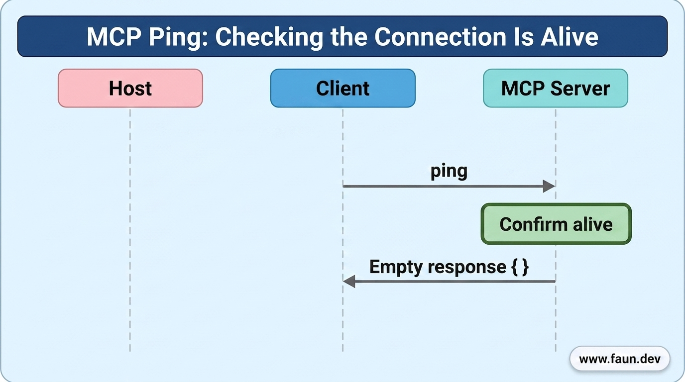


## Progress (Client & Server Side)


```json
{
  "jsonrpc": "2.0",
  "id": 1,
  "method": "tools/call",
  "params": {
    "_meta": {
      "progressToken": "xyz123"
    },
    "name": "longRunningTask",
    "arguments": {}
  }
}
```


```json
{
  "jsonrpc": "2.0",
  "method": "notifications/progress",
  "params": {
    "progressToken": "xyz123",
    "progress": 10,
    "total": 100,
    "message": "Starting task..."
  }
}

// ... some time later
{
  "jsonrpc": "2.0",
  "method": "notifications/progress",
  "params": {
    "progressToken": "xyz123",
    "progress": 50,
    "total": 100,
    "message": "Task is halfway done."
  }
}

// ... and eventually
{
  "jsonrpc": "2.0",
  "method": "notifications/progress",
  "params": {
    "progressToken": "xyz123",
    "progress": 100,
    "total": 100,
    "message": "Task completed."
  }
}
```

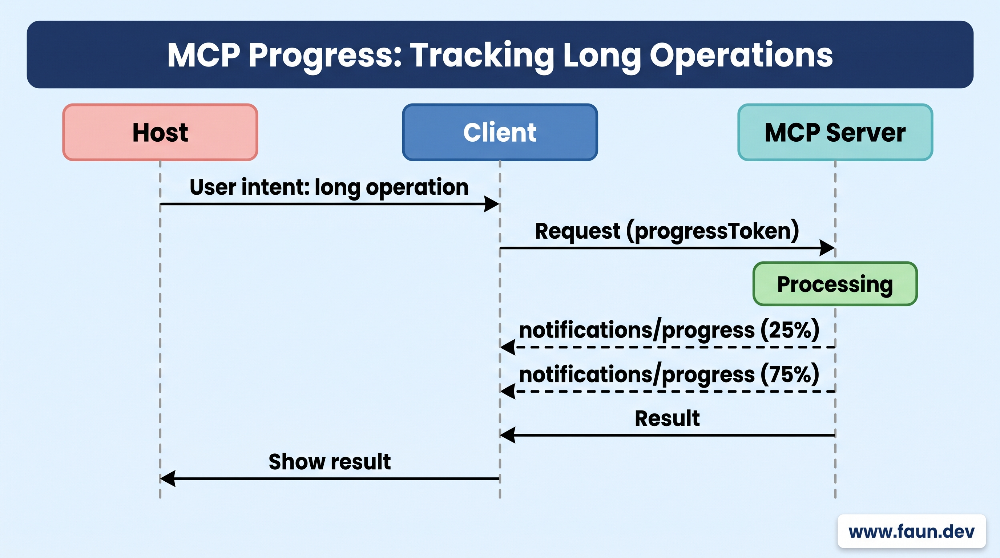


## Tasks (Client & Server Side)


```json
// Normal tools/call request
{
  "jsonrpc": "2.0",
  "id": 1,
  "method": "tools/call",
  "params": {
    "name": "generate_report",
    "arguments": {
      "month": "January"
    }
  }
}
// Normal response (final result returned directly)
{
  "jsonrpc": "2.0",
  "id": 1,
  "result": {
    "content": [
      {
        "type": "text",
        "text": "Report for January generated successfully."
      }
    ],
    "isError": false
  }
}
```


```json
// Task-augmented tools/call request
{
  "jsonrpc": "2.0",
  "id": 2,
  "method": "tools/call",
  "params": {
    "name": "generate_report",
    "arguments": {
      "month": "January"
    },
    "task": {
      "ttl": 60000
    }
  }
}
// Immediate response (CreateTaskResult: the work is not finished yet).
// The response does not contain the tool result.
// It contains a task handle: the task fields wrapped in a `task` object.
{
  "jsonrpc": "2.0",
  "id": 2,
  "result": {
    "task": {
      "taskId": "task-12345",
      "status": "working",
      "createdAt": "2026-11-25T10:30:00Z",
      "lastUpdatedAt": "2026-11-25T10:30:00Z",
      "ttl": 60000,
      "pollInterval": 5000
    }
  }
}
```


```json
// Polling task status
{
  "jsonrpc": "2.0",
  "id": 3,
  "method": "tasks/get",
  "params": {
    "taskId": "task-12345"
  }
}
// Response with the current task status.
// Note: tasks/get returns the task fields directly in `result`,
// NOT wrapped in a `task` object (unlike the CreateTaskResult above).
{
  "jsonrpc": "2.0",
  "id": 3,
  "result": {
    "taskId": "task-12345",
    "status": "working",
    "createdAt": "2026-11-25T10:30:00Z",
    "lastUpdatedAt": "2026-11-25T10:35:00Z",
    "ttl": 60000,
    "pollInterval": 5000
  }
}
```


```json
// Receiver sends an elicitation request when input is required
{
  "jsonrpc": "2.0",
  "id": 5,
  "method": "elicitation/create",
  "params": {
    "mode": "form",
    "message": "Please specify the report format (PDF, Excel, or HTML):",
    "requestedSchema": {
      "type": "object",
      "properties": {
        "format": {
          "type": "string",
          "enum": ["PDF", "Excel", "HTML"],
          "description": "The desired report format"
        }
      },
      "required": ["format"]
    },
    "_meta": {
      "io.modelcontextprotocol/related-task": {
        "taskId": "task-12345"
      }
    }
  }
}
```


```json
// Standard JSON-RPC response to the elicitation/create request
{
  "jsonrpc": "2.0",
  "id": 5,
  "result": {
    "action": "accept",
    "content": {
      "format": "PDF"
    }
  }
}
```


```json
// The real result is fetched later via `tasks/result`.
{
  "jsonrpc": "2.0",
  "id": 4,
  "method": "tasks/result",
  "params": {
    "taskId": "task-12345"
  }
}
// Final response with the actual result
{
  "jsonrpc": "2.0",
  "id": 4,
  "result": {
    "content": [
      {
        "type": "text",
        "text": "Report for January generated successfully."
      }
    ],
    "isError": false,
    "_meta": {
      "io.modelcontextprotocol/related-task": {
        "taskId": "task-12345"
      }
    }
  }
}
```


```json
{
  "name": "generate_report",
  "description": "Generate a monthly report",
  "inputSchema": {
    "type": "object",
    "properties": {
      "month": { "type": "string" }
    }
  },
  "execution": {
    "taskSupport": "required"
  }
}
```


```json
{
  "name": "generate_report",
  "description": "Generate a monthly report",
  "inputSchema": {
    "type": "object",
    "properties": {
      "month": { "type": "string" }
    }
  },
  "execution": {
    "taskSupport": "optional"
  }
}
```


```json
{
  "name": "generate_report",
  "description": "Generate a monthly report",
  "inputSchema": {
    "type": "object",
    "properties": {
      "month": { "type": "string" }
    }
  }
}
```

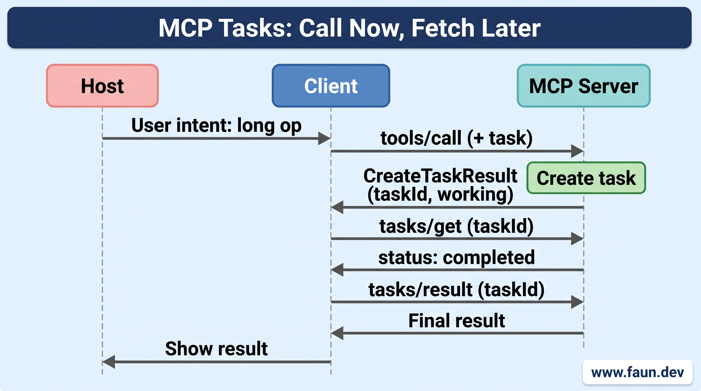


## Primitives vs Capabilities vs Utilities


### Primitives


### Capabilities


### Utilities


### Putting It All Together
