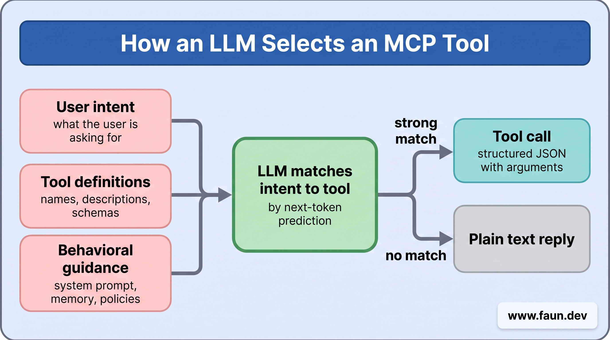

# Following One MCP Request From Prompt to Answer


## Step 1 - Startup, Configuration and Preparation


```json
{
  "mcpServers": {
    "airQuality": {
      "transport": "streamable-http",
      "endpoint": "http://mcp.airquality.com/connect",
      "headers": {
        "x-api-key": "xxx-abc-123"
      },
      "timeout": 5000
    }
  }
}
```


```json
{
  "jsonrpc": "2.0",
  "id": 0,
  "method": "ping"
}
```


```json
{
  "jsonrpc": "2.0",
  "id": 0,
  "result": {}
}
```


## Step 2 - Initialization, Handshake and Capability Negotiation


```json
{
  "jsonrpc": "2.0",
  "id": 1,
  "method": "initialize",
  "params": {
    "protocolVersion": "2025-11-25",
    "capabilities": {
      "sampling": {}
    },
    "clientInfo": {
      "name": "chatbot-app",
      "version": "1.0.0"
    }
  }
}
```


```json
{
  "jsonrpc": "2.0",
  "id": 1,
  "result": {
    "protocolVersion": "2025-11-25",
    "capabilities": {
      "tools": {
        "listChanged": false
      },
      "resources": {
        "subscribe": false,
        "listChanged": false
      },
      "prompts": {
        "listChanged": false
      },
      "experimental": {}
    },
    "serverInfo": {
      "name": "air-quality-mcp-server",
      "version": "2.3.0"
    }
  }
}
```


```json
{
  "jsonrpc": "2.0",
  "method": "notifications/initialized"
}
```


## Step 3 - Discovery and Introspection


```json
{
  "jsonrpc": "2.0",
  "id": 2,
  "method": "tools/list"
}
```


```json
{
  "jsonrpc": "2.0",
  "id": 2,
  "result": {
    "tools": [
      {
        "name": "get_air_quality",
        "description": "Returns current air quality for a given location.",
        "inputSchema": {
          "type": "object",
          "properties": {
            "location": {
              "type": "string",
              "description": "City name, ZIP code, or geocoordinates"
            }
          },
          "required": ["location"]
        }
      }
    ]
  }
}
```


```json
"tools": {
  "listChanged": true
}
```


```json
{
  "jsonrpc": "2.0",
  "method": "notifications/tools/list_changed"
}
```


## Step 4 - Reasoning, Decision-Making and Planning


```text
To answer this, I need the current air quality. I have a 'get_air_quality' tool available. The tool requires a 'location' argument. The user mentioned 'San Francisco', which is a valid location. I will call `get_air_quality` with 'location' set to 'San Francisco'.
```


```json
{
  "tool": "get_air_quality",
  "arguments": {
    "location": "San Francisco"
  }
}
```


## Step 5 - Tool Calling, Execution and Structured Output


```json
{
  "jsonrpc": "2.0",
  "method": "tools/call",
  "params": {
    "name": "get_air_quality",
    "arguments": {
      "location": "San Francisco"
    }
  },
  "id": 3
}
```


```json
{
  "jsonrpc": "2.0",
  "id": 3,
  "result": {
    "content": [
      {
        "type": "text",
        "text": "AQI is 42 (Good) in San Francisco. PM2.5 is 8 ug/m3."
      }
    ],
    "isError": false
  }
}
```


```json
{
  "jsonrpc": "2.0",
  "id": 3,
  "result": {
    "content": [
      {
        "type": "text",
        "text": "Error: Could not retrieve air quality data. The upstream API timed out."
      }
    ],
    "isError": true
  }
}
```


```json
{
  "jsonrpc": "2.0",
  "id": 3,
  "error": {
    "code": -32602,
    "message": "Invalid method parameter(s)."
  }
}
```


```json
{
  "jsonrpc": "2.0",
  "method": "notifications/progress",
  "params": {
    "progressToken": "<unique-token-for-this-progress>",
    "progress": 10,
    "total": 100,
    "message": "Processing data..."
  }
}
```


## Step 6 - Integration: Composing the Final Answer


## Step 7 - The Feedback Loop


```text
Here is the data you requested from the 'get_air_quality' tool.

--
[..RAW JSON DATA..]
--

Now, use this to answer the user's original question.
```


```text
The air quality in San Francisco is currently **Good**. The AQI is **42**, and PM2.5 levels are around **8 µg/m³**, which is well within the healthy range.
```


## Post-Processing & Application Logic


## How The AI Agent Selects and Uses MCP Tools


```json
{
  "name": "get_air_quality",
  "description": "Returns current air quality for a given location. Use this when the user asks about air quality, AQI, smog, or pollution levels for a place.",
  "inputSchema": {
    "type": "object",
    "properties": {
      "location": { "type": "string", "description": "City name, ZIP code, or geocoordinates." }
    },
    "required": ["location"]
  },
  "outputSchema": {
    "type": "object",
    "properties": {
      "aqi": { "type": "number", "description": "The Air Quality Index value." },
      "category": { "type": "string", "description": "A human-readable rating such as Good or Unhealthy." }
    }
  },
  "annotations": {
    "readOnlyHint": true,
    "openWorldHint": true
  }
}
```


```text
The user wants current air quality in San Francisco. I have a tool, get_air_quality, that returns air quality for a location. It takes a location parameter, so this is a strong match. I will call it with location set to San Francisco.

<tool_call>
{
  "name": "get_air_quality",
  "arguments": {
    "location": "San Francisco"
  }
}
</tool_call>
```


```json
{
  "jsonrpc": "2.0",
  "id": 1,
  "method": "tools/call",
  "params": {
    "name": "get_air_quality",
    "arguments": {
      "location": "San Francisco"
    }
  }
}
```


