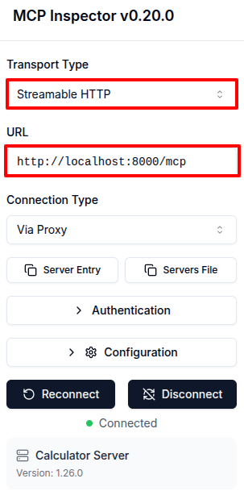
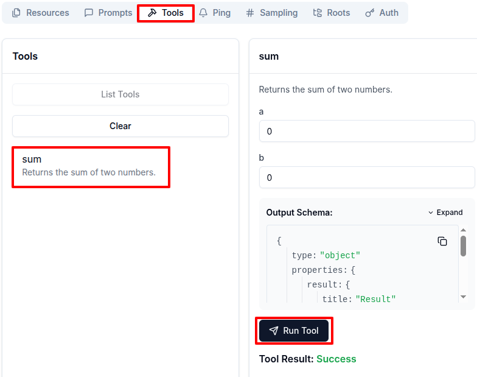

# Your First MCP Server: A Working Calculator in Python


## Installing the Official MCP SDK


```bash
# Create a project directory
mkdir -p $HOME/workspace/mcp-server

cd $HOME/workspace/mcp-server

# Initialize a new uv project
# with a specified Python version (3.12)
uv init --bare --python 3.12

# Add MCP and its cli as dependencies
uv add "mcp[cli]==1.28.1"
```


```bash
# Run the MCP CLI to check if it's working
uv run mcp
```


## Prototyping an MCP Server


```python
cat <<EOF > $HOME/workspace/mcp-server/calculator_server.py
# Import the FastMCP class from the MCP SDK
from mcp.server.fastmcp import FastMCP

# Create a new MCP server instance
mcp_server = FastMCP("Calculator Server")

# Add a tool
@mcp_server.tool()
def sum(a, b):
    """Returns the sum of two numbers."""
    return int(a) + int(b)

# Start the MCP server
if __name__ == "__main__":
  mcp_server.run(transport="streamable-http")
EOF
```


```bash
# cd $HOME/workspace/mcp-server
uv run calculator_server.py
```


## Testing the Server


```bash
curl -i -X POST http://127.0.0.1:8000/mcp \
  -H "Content-Type: application/json" \
  -H "Accept: application/json, text/event-stream" \
  -d '{
    "jsonrpc": "2.0",
    "id": 0,
    "method": "initialize",
    "params": {
      "protocolVersion": "2025-11-25",
      "capabilities": {},
      "clientInfo": { "name": "curl", "version": "0.1" }
    }
  }'
```


```json
HTTP/1.1 200 OK
mcp-session-id: c82aca78fcdd4d6f9917f51251272ca6
// [other headers...]

event: message
data: {
  "jsonrpc": "2.0",
  "id": 0,
  "result": {
    "protocolVersion": "2025-11-25",
    "capabilities": {
      "experimental": {},
      "prompts": {
        "listChanged": false
      },
      "resources": {
        "subscribe": false,
        "listChanged": false
      },
      "tools": {
        "listChanged": false
      }
    },
    "serverInfo": {
      "name": "Calculator Server",
      "version": "1.28.1"
    }
  }
}
```


```bash
export MCP_SESSION_ID=<change-me>
```


```bash
curl -i -X POST http://127.0.0.1:8000/mcp \
  -H "Content-Type: application/json" \
  -H "Accept: application/json, text/event-stream" \
  -H "MCP-Protocol-Version: 2025-11-25" \
  -H "MCP-Session-Id: $MCP_SESSION_ID" \
  -d '{
    "jsonrpc": "2.0",
    "id": "ping_1",
    "method": "ping"
  }'
```


```json
HTTP/1.1 200 OK
mcp-session-id: c82aca78fcdd4d6f9917f51251272ca6
// [other headers...]

event: message
data: {
  "jsonrpc":"2.0",
  "id":"ping_1",
  "result":{}
}
```


```bash
curl -i -X POST http://127.0.0.1:8000/mcp \
  -H "Content-Type: application/json" \
  -H "Accept: application/json, text/event-stream" \
  -H "MCP-Protocol-Version: 2025-11-25" \
  -H "MCP-Session-Id: $MCP_SESSION_ID" \
  -d '{
    "jsonrpc": "2.0",
    "id": "call_sum_1",
    "method": "tools/call",
    "params": {
      "name": "sum",
      "arguments": { "a": 5, "b": 10 }
    }
  }'
```


```json
HTTP/1.1 200 OK
mcp-session-id: c82aca78fcdd4d6f9917f51251272ca6
// [other headers...]

event: message
data: {
  "jsonrpc": "2.0",
  "id": "call_sum_1",
  "result": {
    "content": [
      {
        "type": "text",
        "text": "15"
      }
    ],
    "isError": false
  }
}
```


## The MCP Inspector


```bash
npm i -g @modelcontextprotocol/inspector@0.22.0
```


```bash
# cd $HOME/workspace/mcp-server
npx @modelcontextprotocol/inspector calculator_server.py
```


```text
Starting MCP inspector...
⚙️ Proxy server listening on 127.0.0.1:6277
🔑 Session token: 8efcf5ecb60382471505f3f9cd9ee8c8ccc72213d2189e7551480327fd466e4d
Use this token to authenticate requests or set DANGEROUSLY_OMIT_AUTH=true to disable auth

🔗 Open inspector with token pre-filled:
   http://localhost:6274/?MCP_PROXY_AUTH_TOKEN=8efcf5ecb60382471505f3f9cd9ee8c8ccc72213d2189e7551480327fd466e4d

🔍 MCP Inspector is up and running at http://127.0.0.1:6274 🚀
```


```bash
# Get public IP address
PUBLIC_IP=$(curl -s ifconfig.me)

# Run the inspector with the appropriate environment variables
HOST=0.0.0.0 \
  ALLOWED_ORIGINS=http://$PUBLIC_IP:6274 \
  npx @modelcontextprotocol/inspector
```




