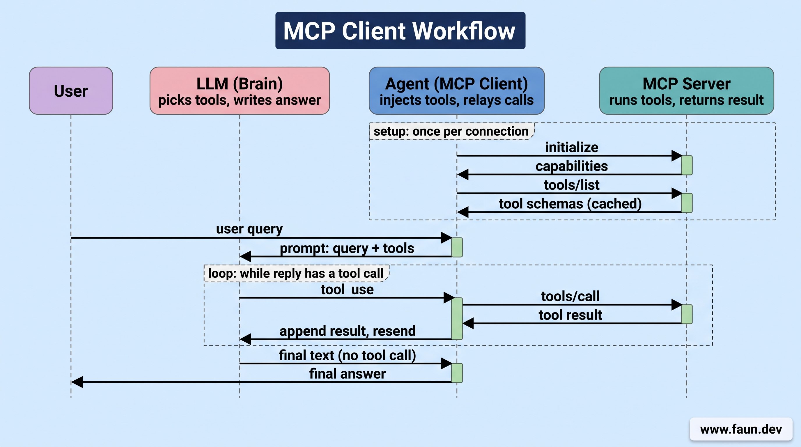
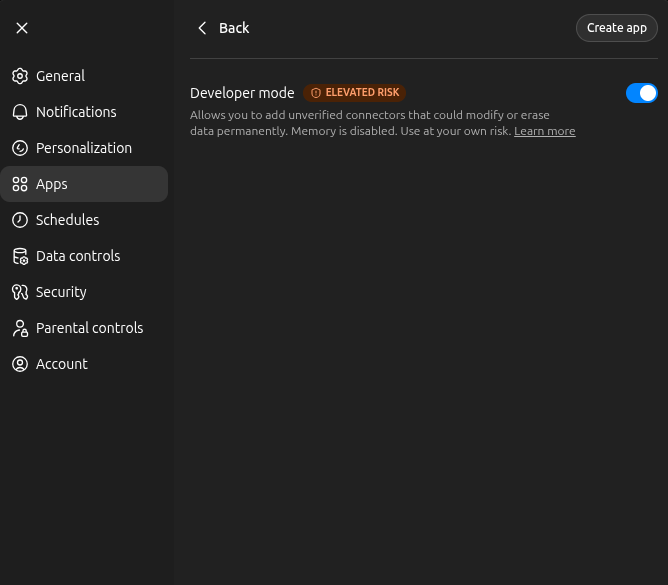
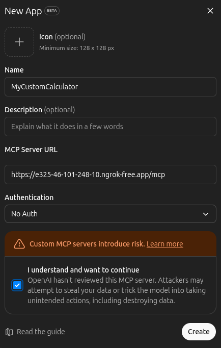
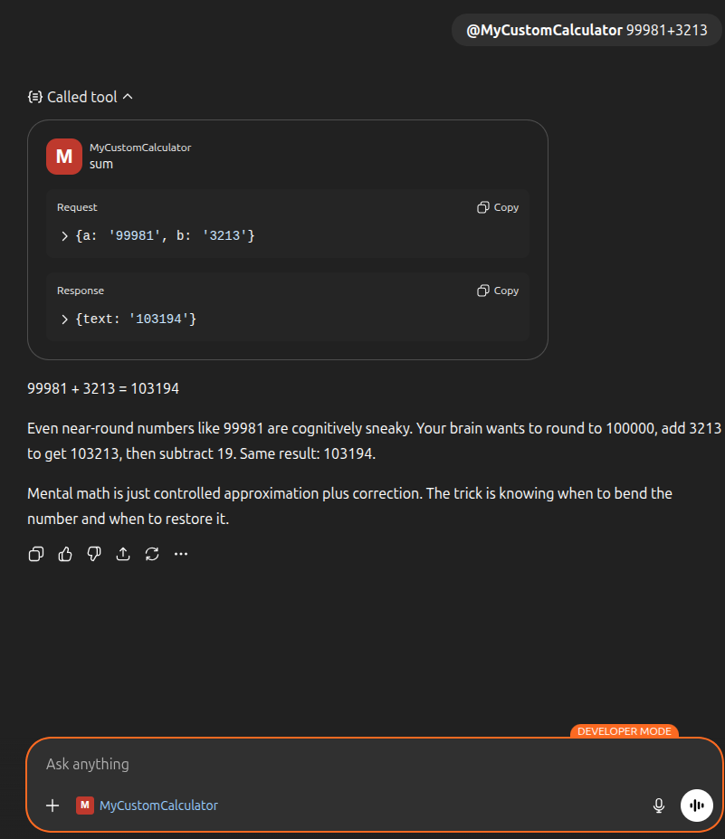
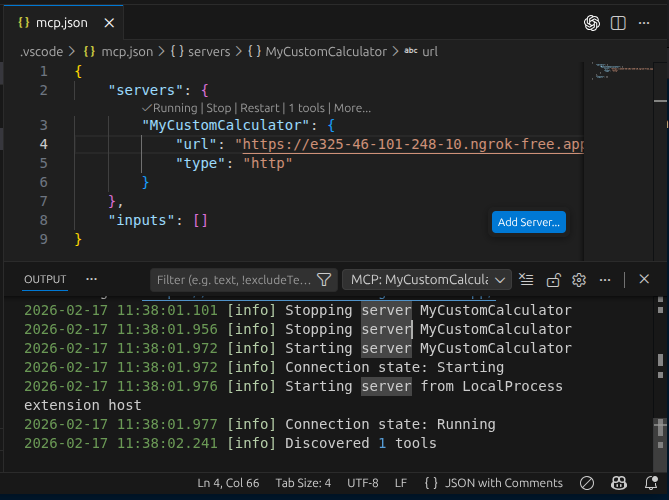
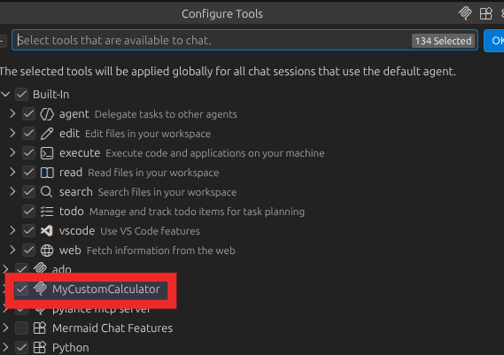
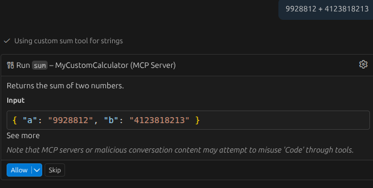
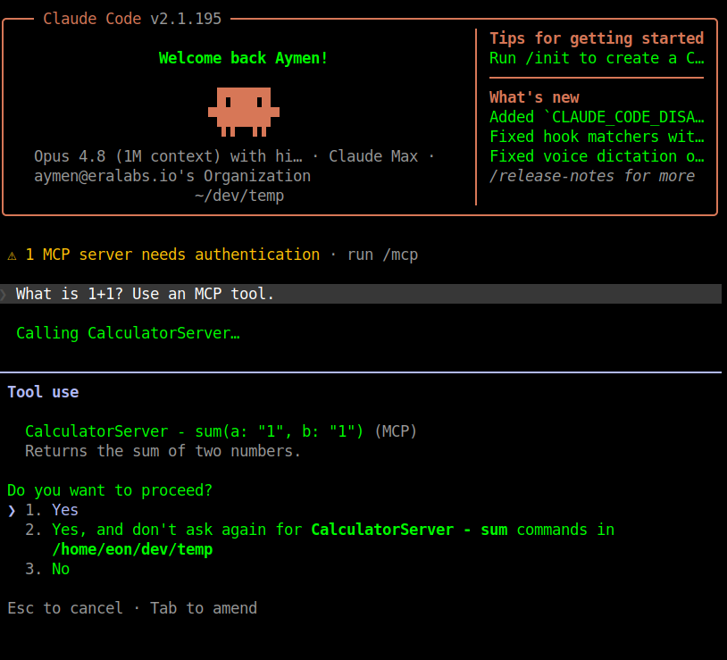

# Build an MCP Client: Wiring an LLM to Your Server


## Overview of Function Calling


```bash
# Add your OpenAI API key to your environment variables
cat <<EOF >> $HOME/.bashrc
export OPENAI_API_KEY="<change_me_with_your_api_key>"
EOF

# Re-source your bashrc to load the new environment variable
source $HOME/.bashrc
```


```bash
mkdir -p $HOME/workspace/openai-tests
cd $HOME/workspace/openai-tests

# Create a new uv project with Python 3.12
uv init --bare --python 3.12

# Add the OpenAI client as a dependency
uv add openai==2.44.0
```


```python
cat <<EOF > $HOME/workspace/openai-tests/test_openai.py
from openai import OpenAI
import os

OPENAI_API_KEY = os.getenv("OPENAI_API_KEY")

client = OpenAI(api_key=OPENAI_API_KEY)

response = client.chat.completions.create(
    model="gpt-5-mini",
    messages=[
        {
            "role": "user",
            "content": "What is the sum of 1 and 2?"
        }
    ]
)
print(response.choices[0].message.content)
EOF
```


```bash
# cd $HOME/workspace/openai-tests/
uv run python test_openai.py
```


```python
cat <<EOF > $HOME/workspace/openai-tests/test_openai.py
from openai import OpenAI
import os

OPENAI_API_KEY = os.getenv("OPENAI_API_KEY")
client = OpenAI(api_key=OPENAI_API_KEY)

response = client.chat.completions.create(
    model="gpt-5-mini",
    messages=[
        {
            "role": "system",
            "content": "You are a helpful assistant that can perform calculations "
            "and always respond in valid JSON format with a 'content' field that "
            "contains the answer to the user's question."
        },
        {
            "role": "user",
            "content": "What is the sum of 1 and 2?"
        }
    ]
)
print(response.choices[0].message.content)
EOF
```


```bash
# cd $HOME/workspace/openai-tests/
uv run python test_openai.py
```


```python
cat <<EOF > $HOME/workspace/openai-tests/test_openai.py
from openai import OpenAI
import os

OPENAI_API_KEY = os.getenv("OPENAI_API_KEY")
client = OpenAI(api_key=OPENAI_API_KEY)

# Define a simple tool function
def say_hi():
    return "Hi there!"


# Create a chat completion request with a tool call
response = client.chat.completions.create(
    model="gpt-5-mini",
    messages=[
        {
            "role": "user",
            "content": "Say hi"
        }
    ],
    tools=[
        {
            "type": "function",
            "function": {
                "name": "say_hi",
                "description": "A simple function that says hi",
                "parameters": {"type": "object", "properties": {}},
            },
        }
    ],
)

# Get the model's message
message = response.choices[0].message

# Check if the model called any tools
if message.tool_calls:
    for tool_call in message.tool_calls:
        print(f"Calling tool: {tool_call.function.name}")
        if tool_call.function.name == "say_hi":
            result = say_hi()
            print(f"Tool result: {result}")

else:
    print("Model did not call any tools.")
EOF
```


```bash
# cd $HOME/workspace/openai-tests/
uv run python test_openai.py
# or
# uv run test_openai.py
```


## Prototyping an MCP Client


```bash
mkdir -p $HOME/workspace/mcp-client
cd $HOME/workspace/mcp-client
```


```bash
# Create a new uv project with Python 3.12
uv init --bare --python 3.12

# Add the MCP SDK and OpenAI client as dependencies
uv add mcp==1.28.1 openai==2.44.0
```


```python
cat <<EOF > $HOME/workspace/mcp-client/client.py
import asyncio
import json
import os
import sys
from mcp import ClientSession
from mcp.client.streamable_http import streamable_http_client
from openai import OpenAI

async def main():
    if len(sys.argv) < 2:
        sys.exit("Usage: python client.py <your question>")

    # The user query is the second argument.
    # Example: uv run client.py "What is 1 + 1?"
    query = sys.argv[1]
    openai = OpenAI(api_key=os.getenv("OPENAI_API_KEY"))
    model = "gpt-5-mini"
    url = "http://127.0.0.1:8000/mcp"

    # Connect to the MCP server using the streamable HTTP transport
    async with streamable_http_client(url) as (read, write, _):
        # Create an MCP client session
        async with ClientSession(read, write) as session:
            # Initialize the session (handshake with the server)
            await session.initialize()

            # Discover available tools from the MCP server
            available_mcp_tools = (await session.list_tools()).tools

            # Convert MCP tools to OpenAI tool format
            tools = [
                {
                    "type": "function",
                    "function": {
                        "name": mcp_tool.name,
                        "description": mcp_tool.description,
                        "parameters": mcp_tool.inputSchema,
                    },
                }
                for mcp_tool in available_mcp_tools
            ]

            # Define the initial messages for the chat completion
            messages = [{"role": "user", "content": query}]

            # Create the initial chat completion request
            response = openai.chat.completions.create(
                model=model, messages=messages, tools=tools
            )

            # Tool calling loop
            while response.choices[0].message.tool_calls:
                messages.append(response.choices[0].message)

                for tool_call in response.choices[0].message.tool_calls:
                    # Get the tool name
                    tool_name = tool_call.function.name
                    # Get the tool arguments
                    tool_args = json.loads(tool_call.function.arguments)
                    # Get the tool ID
                    tool_call_id = tool_call.id

                    # Call the tool on the MCP server
                    result = await session.call_tool(
                        tool_name,
                        tool_args,
                    )

                    # Get the tool result
                    mcp_tool_content = str(result.content)

                    # Append the tool result to the messages with the tool call ID
                    messages.append(
                        {
                            "role": "tool",
                            "tool_call_id": tool_call_id,
                            "content": mcp_tool_content,
                        }
                    )

                response = openai.chat.completions.create(
                    model=model, messages=messages, tools=tools
                )

            openai_response = response.choices[0].message.content
            print("OpenAI response:")
            print(openai_response)


if __name__ == "__main__":
    asyncio.run(main())
EOF
```


## Understanding How the MCP Client Works


### Step 1: Establishing the Connection


```python
async with streamable_http_client(url) as (read, write, _):
    async with ClientSession(read, write) as session:
        await session.initialize()
```


### Step 2: Discovery and Translation


```json
{
  "type": "function",
  "function": {
    "name": "function_name",
    "description": "What the function does",
    "parameters": {
      "type": "object",
      "properties": {
        "param_name": {
          "type": "string",
          "description": "What this parameter is"
        }
      },
      "required": ["param_name"]
    }
  }
}
```


### Step 3: The First Question


```python
response = openai.chat.completions.create(
    model=model, messages=messages, tools=tools
)
```


### Step 4: The Tool Calling Loop (The Courier)


### Step 5: Context Injection


```python
messages.append({
    "role": "tool",
    "tool_call_id": tool_call_id,
    "content": mcp_tool_content,
})
```


```text
User: What is 1 + 1?
AI: I call the "sum" tool with the arguments {"a": 1, "b": 1}.
Tool: The result of 1 + 1 is 2.
```


```python
response = openai.chat.completions.create(
    model=model, messages=messages, tools=tools
)
```


### Step 6: The Final Answer


### The Big Picture: The MCP Client as an Orchestrator




## Testing the MCP Client


```bash
# change directory
cd $HOME/workspace/mcp-server


# Start the MCP server
uv run python calculator_server.py
```


```python
# Import the FastMCP class from the MCP SDK
from mcp.server.fastmcp import FastMCP

# Create a new MCP server instance
mcp_server = FastMCP("Calculator Server")

# Add a tool
@mcp_server.tool()
def sum(a, b):
    """Returns the sum of two numbers."""
    return int(a) + int(b)

# Start the MCP server
if __name__ == "__main__":
  mcp_server.run(transport="streamable-http")
```


```bash
cd $HOME/workspace/mcp-client

uv run python client.py \
    "List the tools you have access to"
```


```text
I have access to the following tools:

- functions.sum
  - Purpose: Returns the sum of two numbers.
  - Parameters: { a: integer, b: integer }
  - Example call: functions.sum({ a: 3, b: 5 })

- multi_tool_use.parallel
  - Purpose: Runs multiple functions.* tools in parallel (only functions namespace tools are permitted).
  - Parameters: { tool_uses: [ { recipient_name: "functions.<function_name>", parameters: { ... } }, ... ] }
  - Example call: multi_tool_use.parallel({ tool_uses: [ { recipient_name: "functions.sum", parameters: { a: 2, b: 4 } } ] })
```


```bash
cd $HOME/workspace/mcp-client

# Run the MCP client with a question that requires tool use
uv run python client.py \
    "What is 2 + 2?"
```


```bash
Created new transport with session ID: ..
Processing request of type ListToolsRequest
Processing request of type CallToolRequest
Terminating session: ...
```


```python
messages = [
    {
        "role": "system",
        "content": "You must always use the sum tool to answer the user's question. "
                   "Do not answer any question without using the tool."
    },
    {
        "role": "user",
        "content": query
    }
]
```


```python
response = openai.chat.completions.create(
    model=model,
    messages=messages,
    tools=tools,
    tool_choice="required",  # Force the model to call a tool
)
```


## OpenAI as MCP Orchestrator


```bash
# Change the working directory
cd $HOME/workspace/mcp-server

# Run the server
uv run python calculator_server.py

# In another terminal, run ngrok to expose it to the internet
ngrok http 8000 \
    --host-header=localhost:8000
```


```python
cat <<EOF > $HOME/workspace/mcp-client/simple_client.py
from openai import OpenAI
import os
import sys

openai = OpenAI(api_key=os.getenv("OPENAI_API_KEY"))
ngrok_url = os.getenv("MCP_SERVER_URL")

# Get the query from command-line arguments
if len(sys.argv) < 2:
    print("Usage: python simple_client.py '<your query>'")
    sys.exit(1)

query = sys.argv[1]

response = openai.responses.create(
    model="gpt-5-mini",
    tools=[
        {
            "type": "mcp",
            "server_label": "CalculatorServer",
            "server_description": "A simple calculator MCP server",
            "server_url": ngrok_url + "/mcp",
            "require_approval": "never",
        },
    ],
    input=query,
)

print(response.output_text)
EOF
```


```bash
# Example (change me)
export MCP_SERVER_URL="https://8040-82-67-183-164.ngrok-free.app"

# Run the simple client
uv run python simple_client.py \
    "Use the calculator tool to calculate 5 + 7 and tell me the result."
```


### Step 1: Request Initiation & Schema Discovery


```bash
INFO Processing request of type ListToolsRequest server.py...
```


### Step 2: Reasoning & Tool Selection


### Step 3: Direct Cloud-to-Cloud Execution


```bash
# Server logs showing the tool call being processed
INFO Processing request of type CallToolRequest
```


### Step 4: Bypassing Approval


### Step 5: Context Injection & Synthesis


### Step 6: The Final Handover


## Connecting Other Applications to our MCP Server


### Connecting ChatGPT to our MCP Server








## Connecting GitHub Copilot to our MCP Server








## Connecting Claude Code to our MCP Server


```bash
claude mcp add --transport http <name> <url>
```


```bash
claude mcp add --transport http CalculatorServer ${MCP_SERVER_URL}/mcp
```


```bash
claude mcp list
```


```bash
Checking MCP server health…
https://xxxx.ngrok-free.app/mcp (HTTP) - ✔ Connected
```


```bash
What is 1 + 1?
```




## What's Next
