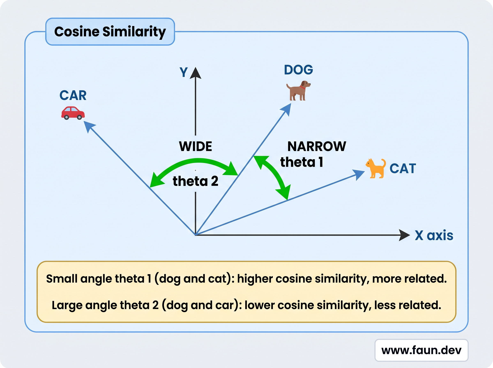
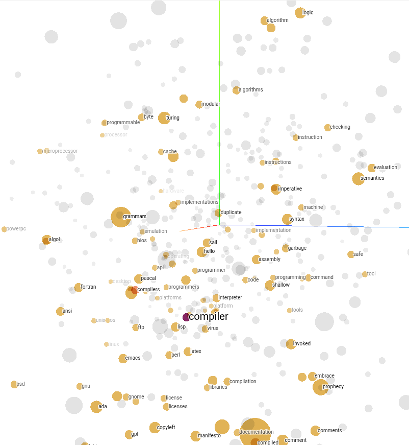
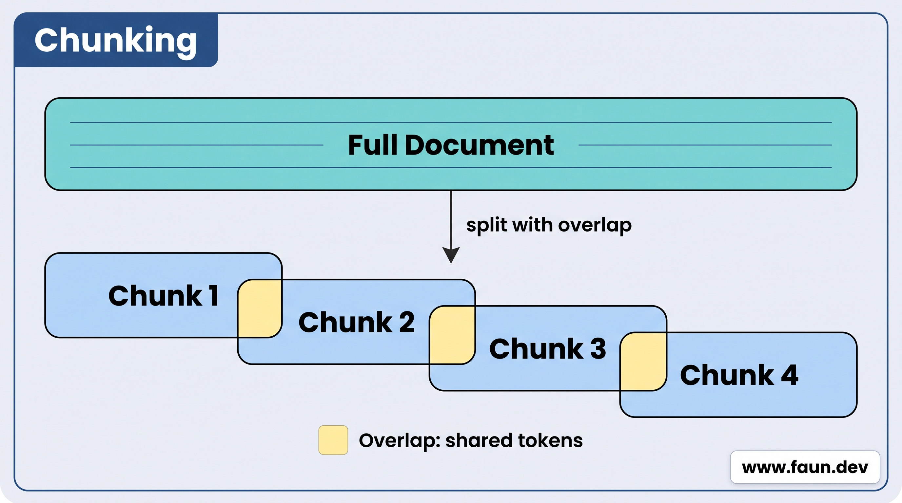
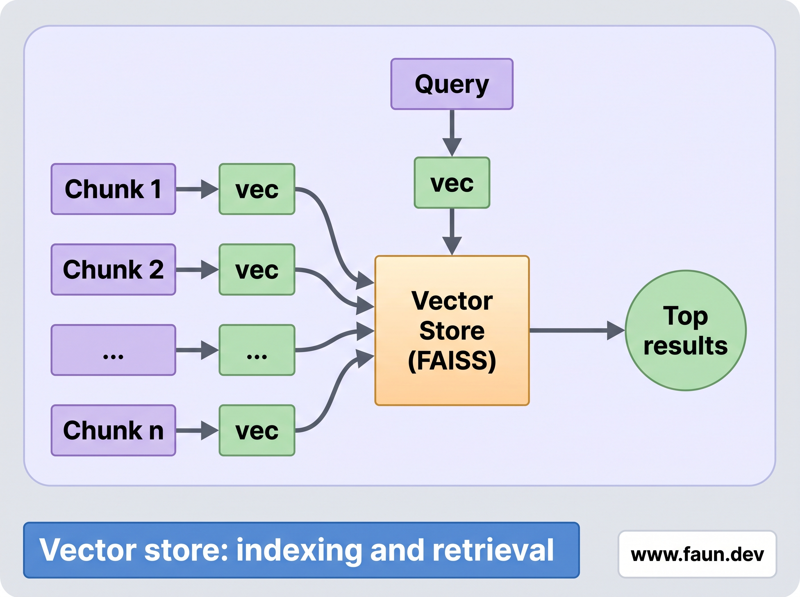
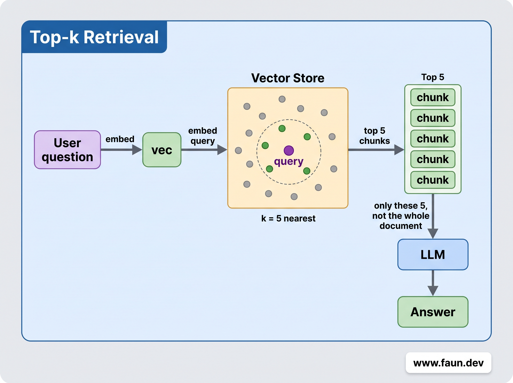
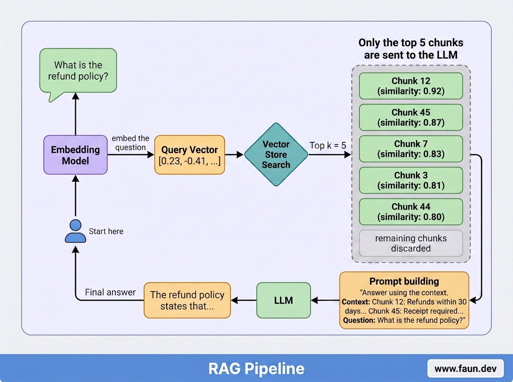

# RAG Meets MCP: Building a Question-Answering MCP Agent


## Embeddings


```text
"The weather is nice" → [0.12, -0.34, 0.78, ...]
"Beautiful day outside" → [0.11, -0.31, 0.80, ...]   ← nearby
"Stock market crashed"  → [-0.55, 0.42, -0.19, ...]  ← far away
```


## Cosine Similarity






## Chunking




## Vector Stores




## Top-k Retrieval




## Retrieval-Augmented Generation (RAG)




## Building a PDF Question Answering RAG Agent


### Step 1: Create the Project


```bash
mkdir -p $HOME/workspace/langchain/langchain_rag_agent

cd $HOME/workspace/langchain/langchain_rag_agent

uv init --bare --python 3.12
```


### Step 2: Install Dependencies


```bash
uv add \
    "langchain-community==0.4.2" \
    "langchain-text-splitters==1.1.2" \
    "langchain-openai==1.3.3" \
    "langchain-mcp-adapters==0.2.1" \
    "faiss-cpu==1.14.3" \
    "python-dotenv==1.2.2"
```


### Step 3: Add Your API Key


```bash
cat > .env <<EOF
OPENAI_API_KEY=your_openai_api_key_here
EOF
```


### Step 4: Write the Agent


#### Imports


```python
import asyncio

from dotenv import load_dotenv
from langchain_community.vectorstores import FAISS
from langchain_text_splitters import RecursiveCharacterTextSplitter
from langchain_mcp_adapters.client import MultiServerMCPClient
from langchain_openai import ChatOpenAI
from langchain_openai import OpenAIEmbeddings

load_dotenv()
```


#### Connect to the PDF MCP Server


```python
client = MultiServerMCPClient(
    {
        "pdf-reader": {
            "transport": "stdio",
            "command": "npx",
            "args": ["@sylphx/pdf-reader-mcp"],
        }
    }
)
tools = await client.get_tools()
read_pdf = next(t for t in tools if t.name == "read_pdf")
```


#### Extract PDF Text


```python
pdf_path = input("PDF path: ").strip()

print("Reading PDF...")
raw = await read_pdf.ainvoke(
    {"sources": [{"path": pdf_path}], "include_full_text": True}
)
full_text = raw if isinstance(raw, str) else str(raw)
```


#### Chunk and Index


```python
splitter = RecursiveCharacterTextSplitter(chunk_size=500, chunk_overlap=50)
chunks = splitter.split_text(full_text)
index = FAISS.from_texts(chunks, OpenAIEmbeddings())
print(f"Ready -- {len(chunks)} chunks indexed.\n")
```


#### Q&A Loop


```python
llm = ChatOpenAI(model="gpt-5-mini")
while True:
    question = input("You: ").strip()
    if not question or question.lower() in {"exit", "quit"}:
        break

    docs = index.similarity_search(question, k=5)
    context = "\n\n---\n\n".join(d.page_content for d in docs)

    answer = llm.invoke(
        "Answer based only on the context below."
        "\n\n"
        f"Context:\n{context}"
        "\n\n"
        f"Question: {question}"
    )
    print(f"Agent: {answer.content}\n")
```


#### Complete Agent Code


```python
cat > agent.py <<EOF
# agent.py
import asyncio

from dotenv import load_dotenv
from langchain_community.vectorstores import FAISS
from langchain_text_splitters import RecursiveCharacterTextSplitter
from langchain_mcp_adapters.client import MultiServerMCPClient
from langchain_openai import ChatOpenAI
from langchain_openai import OpenAIEmbeddings

load_dotenv()


async def main() -> None:
    client = MultiServerMCPClient(
        {
            "pdf-reader": {
                "transport": "stdio",
                "command": "npx",
                "args": ["@sylphx/pdf-reader-mcp"],
            }
        }
    )
    tools = await client.get_tools()
    read_pdf = next(t for t in tools if t.name == "read_pdf")

    pdf_path = input("PDF path: ").strip()

    print("Reading PDF...")
    raw = await read_pdf.ainvoke(
        {"sources": [{"path": pdf_path}], "include_full_text": True}
    )
    full_text = raw if isinstance(raw, str) else str(raw)

    print("Indexing...")
    splitter = RecursiveCharacterTextSplitter(chunk_size=500, chunk_overlap=50)
    chunks = splitter.split_text(full_text)
    index = FAISS.from_texts(chunks, OpenAIEmbeddings())
    print(f"Ready -- {len(chunks)} chunks indexed.\n")

    llm = ChatOpenAI(model="gpt-5-mini")
    while True:
        question = input("You: ").strip()
        if not question or question.lower() in {"exit", "quit"}:
            break

        docs = index.similarity_search(question, k=5)
        context = "\n\n---\n\n".join(d.page_content for d in docs)

        answer = llm.invoke(
            f"Answer based only on the context below.\n\nContext:\n{context}\n\nQuestion: {question}"
        )
        print(f"Agent: {answer.content}\n")


if __name__ == "__main__":
    asyncio.run(main())
EOF
```


### Step 5: Run the Agent


```bash
uv run python agent.py
```


```
PDF path: /home/eon/Downloads/TOS.pdf
Reading PDF...
Indexing...
Ready -- 150 chunks indexed.

You: What is the refund policy?
Agent: The refund policy states that Cisco will provide a refund in exchange for the return of the non-conforming Cisco Offer, subject to applicable law. The refund can be for either: (A) the fees paid for Use Rights in the non-conforming Software; (B) the fees paid for the period in which the Subscription Offer or Service did not conform, less any amounts paid or owed under Service Level Terms; or (C) the fees paid for the non-conforming Hardware.

You: What are the limitations of liability?
Agent: The limitations of liability ...etc

You: exit
```


## What's next
