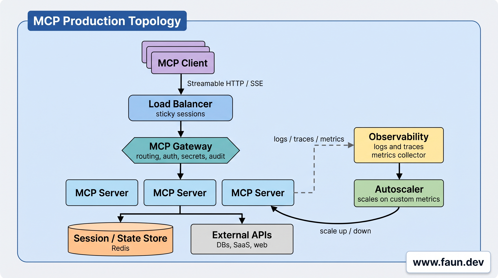
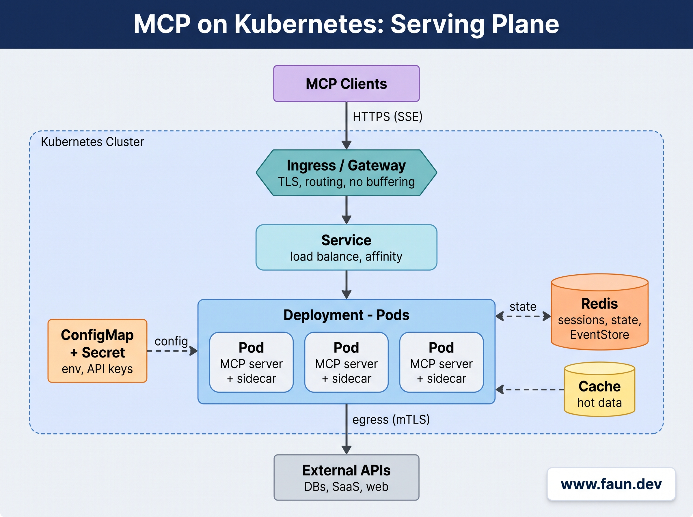
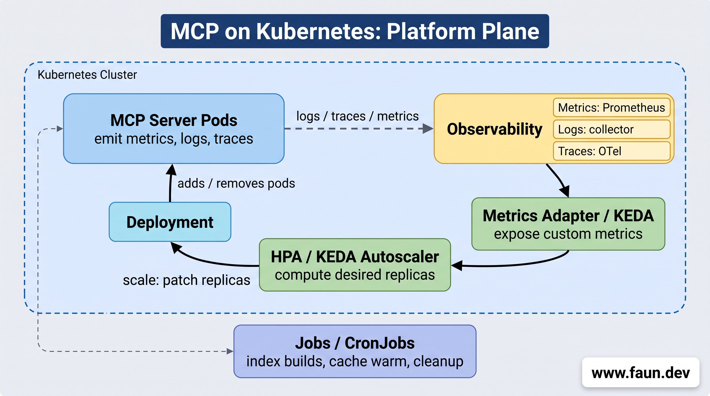

# Deploying FastMCP in Production


## Gateway and Proxy Architectures




### MCP-Native Gateways and Proxies


### Generic Reverse Proxy: NGINX Streaming


```nginx
location /mcp {
  proxy_pass http://mcp_backend;

  # Allow real streaming
  proxy_buffering off;
  proxy_cache off;

  # Forward original client info
  proxy_set_header Host $host;
  proxy_set_header X-Forwarded-For $proxy_add_x_forwarded_for;
}
```


### Serverless/Edge Gateways: Cloudflare Workers and Vercel


### A Summary of Gateway/Proxy Options


## Running FastMCP in Production


### Stateful Mode


```python
from fastmcp import FastMCP
from key_value.aio.stores.redis import RedisStore

mcp = FastMCP(
    "My Server",
    session_state_store=RedisStore(url="redis://localhost:6379")
)
app = mcp.http_app()
```


```python
from fastmcp.server.event_store import EventStore
from key_value.aio.stores.redis import RedisStore

event_store = EventStore(storage=RedisStore(url="redis://localhost:6379"))
app = mcp.http_app(event_store=event_store)
```


### Stateless HTTP Mode (for Horizontal Scaling Without Sessions)


```python
mcp = FastMCP("My Server", stateless_http=True)
app = mcp.http_app()
```


```bash
FASTMCP_STATELESS_HTTP=true \
  uvicorn app:app \
  --host 0.0.0.0 \
  --port 8000 \
  --workers 4
```


## Infra-Level Orchestration & Scalability




### Auto Scalability & Performance


